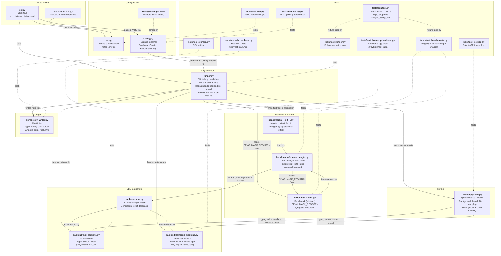

# Repo Mermaid Diagram Implementation Plan

> **For agentic workers:** REQUIRED: Use superpowers:subagent-driven-development (if subagents available) or superpowers:executing-plans to implement this plan. Steps use checkbox (`- [ ]`) syntax for tracking.

**Goal:** Create a Mermaid diagram in `docs/architecture.md` showing every file in the repo, what it does, and how it connects to other files.

**Architecture:** Single Markdown file with an embedded `graph TD` Mermaid diagram using subgraphs to group files by subsystem (Entry, Config, Orchestration, Backends, Benchmarks, Metrics, Storage, Tests). Edges represent import/call relationships with brief labels.

**Tech Stack:** Mermaid graph syntax, Markdown

---

## Chunk 1: Create the diagram file

### Task 1: Write `docs/architecture.md`

**Files:**
- Create: `docs/architecture.md`

- [ ] **Step 1: Write the diagram**

  Create `docs/architecture.md` with the full Mermaid diagram below.

- [ ] **Step 2: Verify the file renders (manual)**

  Open the file in a Mermaid-capable viewer (GitHub, VS Code Mermaid Preview extension, or https://mermaid.live) and confirm layout is legible.

- [ ] **Step 3: Commit**

```bash
git add docs/architecture.md
git commit -m "docs: add Mermaid architecture diagram of all repo files"
```

---

## Diagram content


